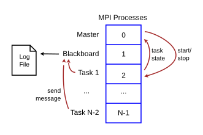
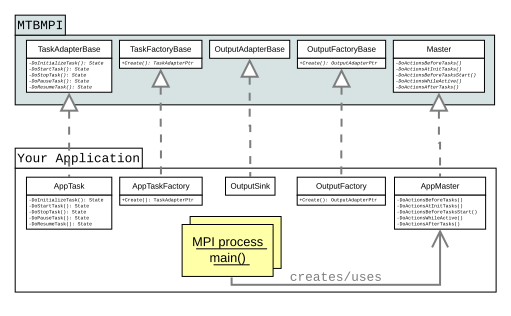

Master-Task-Blackboard MPI Framework                 {#mainpage}
=====================================

# About the MTBMPI Framework

MTBMPI is a C++ library implementing a Master-Task-Blackboard pattern for
controlling and communicating with MPI processes.
The use case for this framework is multiple tasks which can run independently
and concurrently,
and whose state needs to be tracked, and that can write output to a common log.

When running, an MTBMPI application has at least three MPI processes.
Processes of MPI rank 0 and 1 are the Master + Controller and
Blackboard, respectively, and the remaining processes are work tasks.
In the following diagram, MPI is running N tasks.

**Features include:**

* MPI messages are used to communicate with Master and Tasks and the Blackboard.
* Blackboard accepts information to be written to a log file.
* Blackboard can also be an output file sink, e.g. for simulation results.
* Task states are tracked, and changes are recorded in the log file.
* Hook methods allow you to customize actions at initialization, execution, and finalization.
* Communicator class allows you to easily create new communication groups among tasks.
* CommStrings class provides non-blocking send/receives of packed text.
* MPI Timer class tracks elapsed time.
* Date and timestamp functions.
* MPI error management.

**How you use MTBMPI:**

To use this framework, you implement your master and task classes
derived from mtbmpi::Master and mtbmpi::TaskAdapterBase.
Also you will create a task factory and an output manager factory
derived from mtbmpi::TaskFactoryBase and mtbmpi::OutputFactoryBase, respectively.
For each MPI process, your `main()` will create your master class, and run the task.

A callbacks class derived from mtbmpi::MpiCollectiveCB provides
the functions to do things after MPI initialization and before MPI finalization.
These callback hooks allow you to initialize and finalize I/O, for instance.

The base classes have virtual functions which must be implemented.
See the specific class documentation for details.

The library namespace is `mtbmpi`.

# Example application structure

This example shows the inheritance of the concrete classes, but not the
implementation.
No output manager is provided, so the "no-op" version is used instead.
Also, a callbacks class is not used here; instead MTBMPI's "no-op"
child class is used.

@code{.cpp}
#include <iostream>
using std::cout;
using std::endl;
#include "MTBMPI.h"

class AppTask : public mtbmpi::TaskAdapterBase {...}

class AppTaskFactory : public mtbmpi::TaskFactoryBase {...}

class AppMaster : public mtbmpi::Master {...}

int main ( int argc, char **argv )
{
    std::unique_ptr<AppMaster> pMpiTask;
    try
    {
        mtbmpi::Master::TaskFactoryPtr     pTaskFactory ( new AppTaskFactory() );
        mtbmpi::Master::OutputMgrPtr       pOutputMgr   ( new mtbmpi::OutputMgr_NoOp() );
        mtbmpi::Master::MpiCollectiveCBPtr pCallBacks   ( new mtbmpi::MpiCollectiveCB_NoOp() );

        pMpiTask = std::make_unique<AppMaster>(
			argc, argv, pTaskFactory, pOutputMgr, pCallBacks );
        if ( pMpiTask->GetID() == mtbmpi::Master::GetBlackboardID() )
        {
            cout << "Log file name: "
                 << pMpiTask->GetBlackboard().GetRunLogMgr().GetFileName()
                 << endl;
        }
    }
    catch (std::exception const & e)
    {
        // handle exception
    }
    return 0;
}
@endcode

The full example code is in `examples/SimpleExample.cpp`

# Implementing your application

The two main parts of your application that use MTBMPI are the master
and task classes. Your master class will be derived from mtbmpi::Master,
which contains the Controller event loop which checks for MPI messages from tasks.
Your task class will be derived from mtbmpi::TaskAdapterBase,
which in turn is owned by mtbmpi::Task.

There are at least three MPI processes when running an MTBMPI application.
The mtbmpi::Master and mtbmpi::Controller run in
MPI rank zero. The mtbmpi::Blackboard runs as MPI rank 1.
Your application tasks run in MPI ranks 2 and greater.

Communication between MPI processes is done via MPI messages. These can be
blocking or non-blocking, depending upon the task or application need.
For instance, master sends tasks the messages *initialize* and *start*;
tasks send the master messages of change in task state; and to the
Blackboard, tasks send messages to record in the log file.

## The Master class

The mtbmpi::Master class has a Controller, which
monitors status messages sent from tasks,
and can respond to specific task messages that your application
needs, such as *send me configuration*, or *I am done*.
Your master class must call `GetController().Activate()`
for MPI rank == zero (the Controller rank).

For example, the `AppMaster` in the example above could have a
constructor like this:

@code{.cpp}
class WorkMaster : public mtbmpi::Master
{
    public:
	WorkMaster ( /* constructor arguments here */ )
	{
	    try
	    {
		if ( GetID() == GetControllerID() )
		{
		    if ( IsInitialized() )
			GetController().Activate();	// event loop
		}
	    }
	    catch (std::exception const & e)
	    {
		// handle exception
	    }
	}
};
@endcode

Of course, there is more that can be done in your master's constructor,
such as application intialization, creating an MPI error handler,
and checking for startup errors.

The mtbmpi::Master has 5 virtual methods that your application master
class will implement. The methods can do nothing, if not used.
All are private void functions with no arguments:

| function                  | description                         | example use                   |
| :------------------------ | :-----------------------------------| :-----------------------------|
| DoActionsBeforeTasks      | Called before tasks created.        | Read configuration file.
| DoActionsAtInitTasks      | Called before task initialization.  | Open output files.
| DoActionsBeforeTasksStart | Called before tasks are started.    | Send tasks configuration data.
| DoActionsWhileActive      | Called while action loop is active. | Receive data from tasks.
| DoActionsAfterTasks       | Called after tasks are stopped.     | Close output files.

## Your Application Task

Your application's task class will be derived from mtbmpi::TaskAdapterBase.
That in turn has a parent mtbmpi::Task.
Here, both together will be referred to as "the task".

A task does the work of the application. Tasks know their state, and need to keep the Master/Controller
informed of changes in their state. Tasks are sent messages to initialize, start, and stop.

### Task State

The task is responsible for knowing its state, and for telling
the Master when its state changes.

The state of each task is tracked by mtbmpi::Tracker.
Tasks can have the following states, defined in `State.h`:

| enum State         | description                                     |
| :----------------- | :-----------------------------------------------|
| State_Unknown      | initial state of a task
| State_Created      | task has been instantiated, but not initialized
| State_Initialized  | task has been initialized, but not started
| State_Running      | task is currently running
| State_Completed    | task has completed without an error
| State_Paused       | task has paused
| State_Terminated   | task has been terminated without an error
| State_Error        | task has stopped with an error

At every change of state, your application task should inform
MTBMPI of the new state using

@code{.cpp}
GetParent()->SetState( newState )
@endcode

The virtual methods which your task implements will return the current mtbmpi::State of the task.

### Task Messages

Messages are sent to tasks from the Master/Controller, and can be sent from
tasks to the Blackboard's log file via the LoggerMPI object.
Your application can send messages to tasks or between tasks.
Each message has a tag that declares its kind of message content.

Message tags are defined in `MsgTags.h`.
Here are some tags that your task can use:

enum MsgTags       | description                     |
:----------------- | :-------------------------------|
Tag_CmdLineArgs    | contains command-line arguments
Tag_RequestConfig  | want configuration data
Tag_Configuration  | contains configuration data
Tag_LogMessage     | contains message for log file
Tag_ErrorMessage   | contains error message
Tag_Data           | contains data for destination
Tag_TaskResults    | contains task results
Tag_Confirmation   | requesting confirmation

Each task is asynchronously sent a message to "Initialize", then "Start"
after MPI initialization is complete.
The sequence of messages sent to each task by the master are:

    Tag_InitializeTask - After MPI initialization and before task starts
    Tag_StartTask      - After task initialization

Your application task can send additional messages with data, such as
command-line arguments and other initialization data.

To send a log message to the Blackboard, the application task
uses the mtbmpi::Task function:

@code{.cpp}
GetParent()->SendMsgToLog( msg );
@endcode

Separate tags are provided for labeling configuration information,
other data, and task results, so that your application can route
the information provided to the appropriate destination.

To learn how to use Blackboard's OutputMgr as an task output sink,
see [Using the Blackboard OutputMgr](@ref Using_the_Blackboard_OutputMgr)

### Task Virtual Methods

The mtbmpi::TaskAdapterBase has five virtual methods that your application task
class will implement. All are private void functions with no arguments:

| function           | description              | example use                   |
| :------------------| :----------------------- | :-----------------------------|
| DoInitializeTask   | Initialize task          | Receive configuration data.
| DoStartTask        | Start task execution     | Run the task.
| DoStopTask         | Stop task execution      | Task is forced to terminate.
| DoPauseTask        | Pause task execution     | Stop task temporarily.
| DoResumeTask       | Resume a paused task     | Continue running task.

### Sending data to tasks

You can make a mtbmpi::Communicator object to identify which tasks to receive
configuration information or other data. Send this information after the tasks
have been created, i.e., at task initialization. Since this is a collective
operation, all tasks to share in this communication need to create the
mtbmpi::Communicator.

@code{.cpp}
mtbmpi::Communicator comm ( "Tasks", ranks );	// include rank zero == the sender
DisplayMsg( myRank, "Communicator initialized from ranks = ", MakeRanksString(ranks) );
@endcode

The mtbmpi::CommStrings class sends an array of strings to specified tasks,
using an MPI communicator. These strings can be command-lines or other
configuration data.

@code{.cpp}
mtbmpi::CommStrings commStrings ( myRank, Log(), comm );
for ( int taskID = 1; taskID < comm.GetComm().Get_size(); ++taskID )
    commStrings.Isend( taskID, mtbmpi::Tag_CmdLineArgs, strVec );
commStrings.WaitAll();		// wait for all ISends to complete
@endcode

An example of using CommStrings in this way is in
[`tests/Test_CommStrings.cpp`.](_2tests_2_test__comm_strings_8cpp-example.html)

@note{
When a mtbmpi::Communicator is made from a subset of all tasks, the
ranks in the new group and communicator will be sequential and
contiguous. E.g, MPI::COMM_WORLD ranks (0, 2, 3) will be (0, 1, 2)
in the new Communicator.
}

## Using the Blackboard OutputMgr					{#Using_the_Blackboard_OutputMgr}

In concurrent processes, there are a limited number of methods
to write output from multiple tasks to files.
Perhaps the simplest method is where each task writes
its output to a task-specific file, but this method can overload
systems when running more than a few or a few tens of tasks,
depending upon the amount of output data written.
The operating system must be comfortable with a large number
of file handles open simultaneously.

A common alternative is to have one process that collects all the
output from concurrent tasks, and writes to a file. This method
assumes that interprocess communication is more efficient than
process-to-disk transfers. There are libraries providing this
method: HDF5 and NetCDF4 built with parallel mode; MPI IO is
available in version 2 or higher.

As an alternative to these other libraries,
mtbmpi::Blackboard provides an OutputMgr object,
to which your tasks can send their output data.
Your task will send an MPI message to Blackboard
with the message tag `Tag_TaskResults`.
Blackboard will forward the message to its OutputMgr.

mtbmpi::OutputMgr is a base class with a virtual function HandleOutputMessage.
You will need to create a class inheriting OutputMgr and implementing
HandleOutputMessage to receive and process the message.
You can use the class mtbmpi::CommStrings in your tasks to send an
array of strings to the Blackboard, as well as use it in
your HandleOutputMessage to receive the output.
The techniques in the Isend and Receive methods in
mtbmpi::CommStrings can be easily modified to transfer other kinds of data.

An example of implementing an OutputMgr child class is in
[`examples/OutputMgrExample.cpp`.](_2examples_2_output_mgr_example_8cpp-example.html)
The class method `WorkTask::SendToOutput` sends information to Blackboard via MPI,
and `OutputMgr::HandleOutputMessage` receives the message and directs it
to `OutputSink::Write`.

# Build and Install the Library

CMake is used to build the MTBMPI library. Build types are

* Debug
* Release

## Build the debug version of the library

    cd build/cmake
    cmake -DCMAKE_BUILD_TYPE=Debug -DCMAKE_INSTALL_PREFIX:PATH=../../tests/install ..
    make

The library will be located in the file

    build/cmake/libmtbmpi.debug.a

## Build the release version of the library

This example specifies `/usr/local` as the root directory for the installation.

    cd build/cmake
    cmake -DCMAKE_BUILD_TYPE=Release -DCMAKE_INSTALL_PREFIX:PATH=/usr/local ..
    make

The library will be located in the file

    build/cmake/libmtbmpi.a

Install the library:

    sudo make install

The files installed (for a Release build) are:

    [CMAKE_INSTALL_PREFIX path]
    |-- lib64/libmtbmpi.a
    `-- include/*.h

# Building and Running the Examples

Make the library:
See [Build and Install the Library](#Build and Install the Library).

## Simple Example

Assuming the library file is present in the cmake build tree,
make the simple example executable with:

    cd examples
    mpicxx -I../src -o SimpleExample -g SimpleExample.cpp  ../build/cmake/libmtbmpi.debug.a

Change `libmtbmpi.debug.a` to `libmtbmpi.a` if you are using the release build of the library.

Run the example with 2 work tasks:

    mpiexec -n 4 ./SimpleExample

Out to the console looks like this:

    Test of the MTBMPI framework.
    Log file name: SimpleExample.log
    process 1: started on CPU: cpu1
    process 1: completed
    process 2: started on CPU: cpu2
    process 2: completed
    process 0: started on CPU: cpu0
    process 0: completed
    process 3: started on CPU: cpu3
    process 3: completed

The log file contains:

    2020-01-01_15-36-55: Command-line arguments: none
    2020-01-01_15-36-55: Tracker ID 1: WorkTask::DoInitializeTask
    2020-01-01_15-36-55: Tracker ID 2: WorkTask::DoInitializeTask
    2020-01-01_15-36-55: Tracker ID 1: state = Initialized
    2020-01-01_15-36-55: Tracker ID 2: state = Initialized
    2020-01-01_15-36-55: Tracker ID 1: WorkTask::DoStartTask
    2020-01-01_15-36-55: Tracker ID 2: WorkTask::DoStartTask
    2020-01-01_15-36-55: Tracker ID 1: WorkTask: ratio * id = 1.33325
    2020-01-01_15-36-55: Tracker ID 1: state = Completed
    2020-01-01_15-36-55: Tracker ID 2: WorkTask: ratio * id = 1.99988
    2020-01-01_15-36-55: Tracker ID 2: state = Completed
    2020-01-01_15-36-55: Controller: all tasks are stopped.
    2020-01-01_15-36-55: Elapsed time for all tasks (seconds): 0.310147
    2020-01-01_15-36-55: Blackboard stopped.

# Requirements and Compatibility

Your C++ compiler must build to the C++ 11 or newer standard.

This library has been tested and extensively used on Linux systems,
and Cygwin on Microsoft Windows (64-bit) systems using
the GNU g++ compiler (versions >= 5).

MPI versions 1 or 2 are required because the C++ MPI implementation was
removed from the MPI version 3 standard. Your MPI version 3 or greater
may still work if the C++ implementation is provided.

The build system uses CMake, version 3.10 or greater.

Documentation is generated by Doxygen (version 1.8 or newer).

# Additional Information

MPI Reference (OpenMPI):
https://www.open-mpi.org/doc/v2.1/

CMake reference:
https://cmake.org/cmake/help/v3.10/index.html

Doxygen reference:
https://www.doxygen.nl/manual

The GNU g++ compiler reference:
https://gcc.gnu.org/

# License

This software library, including source code and documentation,
is licensed under the Apache License version 2.0.
See @ref license "LICENSE.md" for more info.

The MTBMPI library is a fork of the original IRC::MPIMSB library,
which is part of the IRC project source code,
at the Natural Resource Ecology Laboratory,
Colorado State University, Fort Collins, CO USA.
The MPIMSB code was developed with USA government funding, and
cannot be copyrighted. The Apache Copyright specified herein
applies to this modified, enhanced, and otherwise mostly
incompatible version, and to all post-IRC documentation and
examples.
